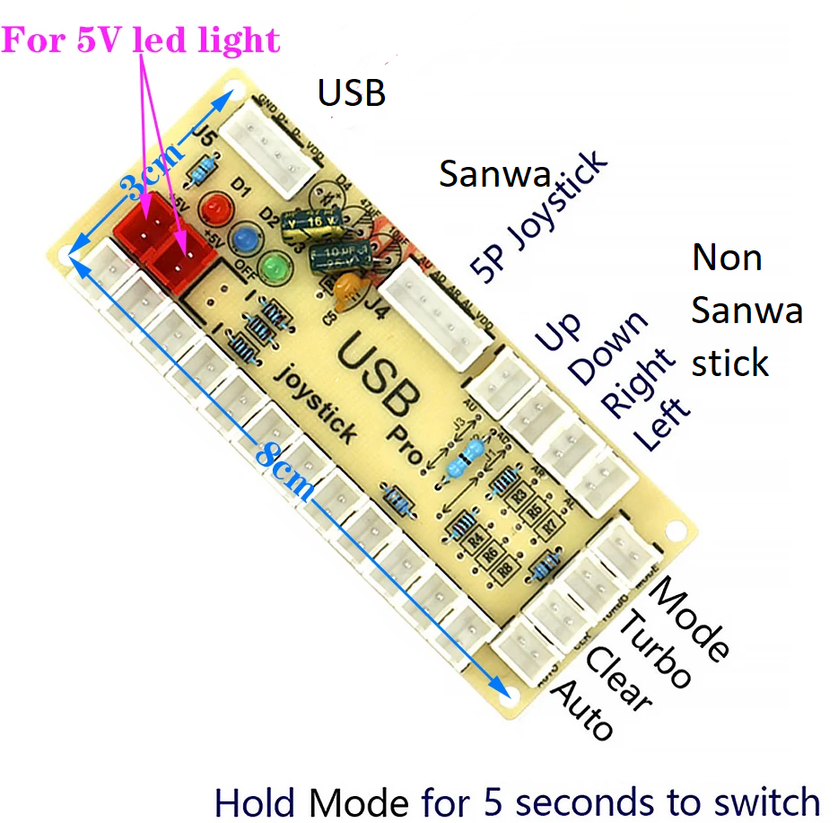

# Controller Reference

This page documents how I've configured the 2 USB-zero delay "Dragonrise" branded decoders on my system.  These were sourced from AliExpress. I went for the cheapest I could find.  They work well!  

Depending on your PC/Pi - I found the player controls would sometimes swap on reboot.  The [wiki](https://wiki.batocera.org/diy-arcade-controls?s[]=spinner#i_use_dragonrise_encoders_and_player_1_and_player_2_s_inputs_are_swapped) has a solution which I applied and have not since had a problem.  

I am using [Sanwa JLF-TP-8YT joysticks](https://focusattack.com/sanwa-jlf-tp-8yt-joystick-precursor-to-jlx-tp-8yt/) with the [TOS GRS 4/8 way servo switched restrictor gates](https://github.com/DaveBullet1050/BatoceraHelpers/blob/main/README/TOS_GRS_Switch%20README.md#tos-grs---automatic-48-way-restrictor-gate).  I am also using 30mm screw in Sanwa buttons for the player buttons, with a mix of 24mm buttons for coin, select and start and Happ style P1/2 start buttons.  I am also using a cheapo CH-616 coin acceptor, allowing coins to add credits for MAME games.

## Physical layout
Here's the final control panel. The only difference to the mock/test panel (see below), is I added a spinner, blue button next to spinner and a black button.  The black button is used to power down the PC if held for ~3 seconds.  A double click will power back up (this is just connected to the left mouse button of an old mouse, connected to the "wake on USB" port of the PC to perform the wakeup).  The blue button (next to spinner) is used as a [shader flipper in retroarch](https://github.com/DaveBullet1050/BatoceraHelpers/blob/main/README/SideBySide%20README.md)  
  

My mockup panel is shown below:
  
Black labels are what you see in Emulation Station and RetroArch - essentially mapping to a virtual gamepad style controller (aka XBox/PS etc...)
Red labels are where the button physically plugs into the USB zero delay encoder (starting at a zero offset, i.e. button 1 plugs into slot 0).  
Backside:  
  

Here's the physical USB zero delay encoder (aka Dragonrise as recognised in Linux/Batocera) as per:  
  

Here's another image showing the connectors and what they do:  
  

## Controller axes and button mapping
There is no way to configure each (player 1 and 2) USB delay encoders with a different button configuration.  ES / Batocera only has one configuration for one type of controller, therefore you must lay out Player 2 buttons the same way (albeit there are no physical select and start buttons as per player 1).  The purple glowing button on the top left is the TOS / GRS 4/8 way selector which connects to its own controller board (which itself is USB attached to the Pi).  Refer to the last in: [es_input.cfg](https://github.com/DaveBullet1050/BatoceraHelpers/blob/main/userdata/system/configs/emulationstation/es_input.cfg), ie:  

```
	<inputConfig type="joystick" deviceName="DragonRise Inc.   Generic   USB  Joystick  " deviceGUID="03000000790000000600000010010000">
		<input name="a" type="button" id="4" value="1" code="292" />
		<input name="b" type="button" id="3" value="1" code="291" />
		<input name="down" type="axis" id="1" value="1" code="1" />
		<input name="l2" type="button" id="6" value="1" code="294" />
		<input name="l3" type="button" id="10" value="1" code="298" />
		<input name="left" type="axis" id="0" value="-1" code="0" />
		<input name="pagedown" type="button" id="5" value="1" code="293" />
		<input name="pageup" type="button" id="2" value="1" code="290" />
		<input name="r2" type="button" id="7" value="1" code="295" />
		<input name="right" type="axis" id="0" value="1" code="0" />
		<input name="up" type="axis" id="1" value="-1" code="1" />
		<input name="x" type="button" id="1" value="1" code="289" />
		<input name="y" type="button" id="0" value="1" code="288" />
		<input name="start" type="button" id="9" value="1" code="297" />
		<input name="select" type="button" id="8" value="1" code="296" />		
	</inputConfig>
```  

You don't have to wire your USB zero delay controller to buttons in the same order.  It's just the order I plugged them in.  I've shown this purely so it helps visualise the setup in the various config files in this repo (i.e. when reading batocera.conf and button "5" is referenced, you know which one it is).  

## Physical to virtual mapping
My config files all reference the buttons as follows:
  

## Full set of configured button combinations
The full open office spreadsheet to show you how the various hotkey combinations and per game overrides I've setup in batocera.conf is here:  
[Button mapping spreadsheet](https://github.com/DaveBullet1050/BatoceraHelpers/blob/main/image/Button%20mapping.ods)  

## How controller mapping works
The basic process is
1. Base ES mapping
2. Batocera uses the ID from controller axis/buttons in the batocera.conf (globally, per core or per game)
3. Batocera generates the relevant config files for the emulator.  For example, Retroarch uses 2 config files. One for the emulator core and one for retroarch itself (more on these below)
4. Batocera launches the emulator, it reads the just generated config files and you play your game with your desired controller mapping  

### Emulation Station mapping
Batocera packages Emulation Station with a bunch of controllers pre-configured.  The mappings are in:  
`/userdata/system/configs/emulationstation/es_input.cfg`  

If you want to change the mapping of buttons system wide, then using ES is the best way to do it (via ES main menu -> CONTROLLER & BLUETOOTH SETTINGS -> CONTROLLER MAPPING).  

To get the ID and CODE values to use (see example above), run:  
`sdl2-jstest -l`  

Which will list all controllers attached and all events supported (joystick axis and buttons) with codes.  And give you a "joystick number:" for each, eg:  
```
# sdl2-jstest -l
Found 2 joystick(s)

Joystick Name:     'DragonRise Inc.   Generic   USB  Joystick  '
Joystick Path:     '/dev/input/event2'
Joystick GUID:     03000000790000000600000010010000
Joystick Number:    0
Number of Axes:     5
Number of Buttons: 12
Number of Hats:     1
Number of Balls:    0
GameControllerConfig:
  Name:    'USB gamepad'
  Mapping: '03000000790000000600000010010000,USB gamepad,a:b2,b:b1,back:b8,dpdown:h0.4,dpleft:h0.8,dpright:h0.2,dpup:h0.1,leftshoulder:b4,leftstick:b10,lefttrigger:b6,leftx:a0,lefty:a1,rightshoulder:b5,rightstick:b11,righttrigger:b7,rightx:a3,righty:a4,start:b9,x:b3,y:b0,platform:Linux,'
Axis code  0:    0
Axis code  1:    1
Axis code  2:    2
Axis code  3:    3
Axis code  4:    5
Button code  0:   288
Button code  1:   289
Button code  2:   290
Button code  3:   291
Button code  4:   292
Button code  5:   293
Button code  6:   294
Button code  7:   295
Button code  8:   296
Button code  9:   297
Button code 10:   298
Button code 11:   299
Hat code  0:   -1
```  

You can then run:  
`sdl-jstest -e 0`  

And get a running list of events.  Pressing a joystick axis, or buttons will return something like this.  Here's my "A" button:  
`SDL_JOYBUTTONUP: joystick: 0 button: 4 state: 0 code:292`  

As you can see I map the button (ID) and code (CODE) in the es_input.cfg:  
`		<input name="a" type="button" id="4" value="1" code="292" />`  

Alternatively run:  
`sdl-jstest -t 0`  

to get a visual representation of the controller inputs and a '#' being displayed on a button push or axis movement.   

Another utility than can display button codes is:  
`evtest`  

### Batocera.conf settings - Retroarch example
If you configure Batocera (via Emulation Station) to use a "libretro" based core to emulate your games, you can change or map any of the Retroarch functions.

At step 3 above in the launch process Batocera generates 2 Retroarch files:  
```
/userdata/system/configs/retroarch/retroarchcustom.cfg
/userdata/system/configs/retroarch/cores/retroarch-core-options.cfg 
```  
I find it easiest to launch a retroarch game, then look at what values are in the above files, then reverse engineer what should go into batocera.conf, eg:  
```
<system_name>.retroarch.<setting>=<value>
<system_name>.retroarchcore.<setting>=<value>
```  

i.e. the settings from:  
`/userdata/system/configs/retroarch/retroarchcustom.cfg`  
go into batocera.conf as:  
`<system_name>.retroarch.<setting>=<value>`  

and those in:  
`/userdata/system/configs/retroarch/cores/retroarch-core-options.cfg`  
go into batocera.conf as:  
`<system_name>.retroarchcore.<setting>=<value>`  

`<system_name>` matches the folder under `/userdata/roms` i.e. the name of the emulation system (e.g. c64, c20, mame, megadrive etc...).  Use `global` if you want your setting to apply to all systems.  <system_name> can specify a specific game of that system too (by following with square brackets and rom/filename of game in speech marks) - e.g. mame["robotron.zip"].retroarch.....  

If you need keymaps, [input_keymaps.c](https://github.com/libretro/RetroArch/blob/master/input/input_keymaps.c) has the full list.  

Do read [retroarch.cfg](https://github.com/libretro/RetroArch/blob/master/retroarch.cfg) thoroughly as it explains a lot on how retroarchcustom settings works.  

For example - if you want to launch all c64 games for a retroarch core with a 270 degree screen rotation, we find this in retroarchcustom.cfg as:  
`video_rotation = 270`  

Therefore our batocera.conf should contain:  
`c64.retroarch.video_rotation=270`  

If you want to disable inputs for a key or button you can assign "nul" to these, eg:  
```
global.retroarch.input_hold_fast_forward_btn=nul
global.retroarch.input_load_state_btn=nul
global.retroarch.input_save_state_btn=nul
```  
Strip the _btn suffix if you want to disable the keyboard binding for that operation.  

You can add an _axis suffix if you want the input to be a joystick direction (instead of button or keyboard).  eg:  
```
global.retroarch.input_hold_fast_forward_axis=+0
global.retroarch.input_hold_fast_forward_btn=7
global.retroarch.input_hold_fast_forward=q
```  
Sets the fast forward control to be activated (with hotkey pressed) either on right joystick movement , button number 7 (indexed from 0 on my USB encoder - see above) or letter Q on keyboard.  

See my [batocera.conf](https://github.com/DaveBullet1050/BatoceraHelpers/blob/main/userdata/system/batocera.conf) for various examples.

### Providing key overrides and these being "ignored" by libretro/RetroArch
For games that require key presses, we can get that by the pad2key function in Batocera.  This inputs key(s) when a button (or joystick axis) is pressed.  You can create these at a system or game level as per the [wiki](https://wiki.batocera.org/remapping_controls_per_emulator#pad2key).  

However, you may find your buttons still don't generate the key presses.  To make sure this works, you need to turn game focus mode off (this is called "keyboard passthrough" in either system or game options) plus you may need to disable retroarch from providing its own button mapping for the button you are trying to send key presses for.  To do this, add this to your batocera.conf (example only):  
`<system_name>["<game_rom_filename>"].retroarch.input_player1_<button>_btn=null`  
e.g.  
`prboom["doom1_shareware.wad"].retroarch.input_player1_x_btn=nul`  

This stops retroarch from hijacking or capturing the button press, meaning your pad2key will work and send the key you've mapped when you created the game (or system) level pad 2 key profile.  

## Spinner setup  
For Retroarch, you need to configure 2 settings in your batocera.conf:  
```
global.retroarch.input_player1_mouse_index=<correct index number>
global.retroarchcore.mame_mouse_enable=enabled
```

Note: the *input_player1_mouse_index* above will change in your system (and may change depending on order assigned for controllers by udev on reboot).  The [wiki](https://wiki.batocera.org/diy-arcade-controls?s[]=spinner#i_have_a_two_devices_that_are_recognized_as_mice_and_i_have_to_reconfigure_them_every_launch) provides a solution on each game launch, however this depends on enabling retroarch logging and uses the last game launch value, which may change between games *if* you plug / unplug mouse devices.  

I've created a simpler script here, that doesn't require retroarch logging and just looks at udev mouse devices (where the eventXX number infers order).  Put this in /usr/bin:  
[/usr/bin/get-spinner-index](https://github.com/DaveBullet1050/BatoceraHelpers/blob/main/usr/bin/get-spinner-index)  

Edit the top variable:  
`spinner='usb-Baolian_industry_Co.__Ltd_TS-BSP-Ultra'`  
to be the name of your spinner device as described in the script (i.e. enough of the filename to uniquely match your spinner under /dev/input/by-id)  

Download this script, which will set the correct index each game launch:  
[/userdata/system/scripts/store_spinner_index.sh](https://github.com/DaveBullet1050/BatoceraHelpers/blob/main/userdata/system/scripts/store_spinner_index.sh)  

Finally (as a one off), ensure you manually add the following to your batocera.conf:  
`global.retroarchcore.mame_mouse_enable=enabled`  

## Custom controller mappings (i.e. stopping Batocera from generating per game launch)
Batocera is good in that it will regenerate configuration files when launching mame under retroarch or stand alone.  This includes controller axis/button mappings (obtained from ES config). You may want avoid this, and use (for example) mame's internal input assignments at a per game or system wide level.  This may be easier to allow tailoring specific game controls.  A good example is where you want for Robotron 2084 for example, to map within mame, the player 2 joystick as the directional fire "button".  It's possible but messy to do this via batocera.conf retroarch settings.  

To prevent Batocera from regenerating controller mappings, set one of these in your batocera.conf:  

Do not generate per any core/system mappings:  
`global.customcfg=1`  

Generate mappings for all systems, except mame:  
`mame.customcfg=1`  

## Dragonwise USB encoder phantom Z axis inputs cancelling screen saver
The Dragonrise encoders emit a constant deadzone (127) value on the AXIS_Z.  This happens regardless of analogue (axes) or digital (HAT) mode the encoder is in.  This causes Batocera to think there has been an input and therefore wakes up ES.  

Although this may not completely eliminate these phantom inputs, run the following command to suppress constant AXIS_Z inputs.  Do this for each USB encoder:  
`evdev-joystick --evdev /dev/input/event17 --axis 2 --fuzz 255 --deadzone 127`  

Replace:  
`/dev/input/event17`  
with the event corresponding to your USB encoder (run "evtest" to display).  

I'll eventually script this so it auto-detects and applies the values on 2 joysticks.  
